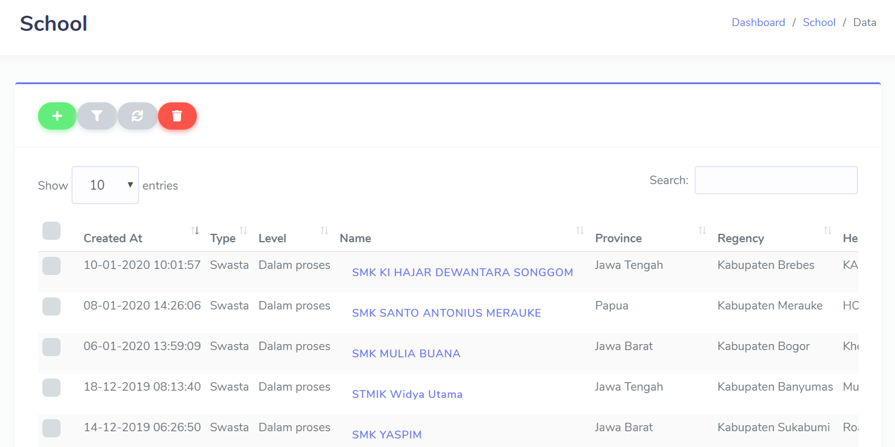

# The Basic
 >Bagian ini akan menunjukan tentang table basik yang yang ada di [ACP System](http://system.axiooclassprogram.org/) dan juga kegunaan nya.

## Table Design
 

 Pada bagian ini terdapat bebearapa bagian yang fungsi nya berbeda dan juga kegunaan nya pun berbeda.

### Menambahkan data atau file
 

 Fitur ini adalah fitur untuk menambahkan data atau file yang akan dikirimkan ke sekolah binaan ACP yang sudah terdaftar di [ACP System](http://system.axiooclassprogram.org/).

### Filter
 

  Bagian ini adalah untuk memfilter atau memilih sekolah binaan ACP yang sudah terdaftar di [ACP System](http://system.axiooclassprogram.org/).

### Refresh
 
 
 Pada bagian ini adalah fitur refresh. refresh adalah untuk membuat halaman kembali dengan normal atau mengubah pengaturan agar memperbarui tampilan yang ada di [ACP System](http://system.axiooclassprogram.org/).

### Delete
 

  Pada bagian ini merupakan fitur yang bisa menghapus data dari [ACP System](http://system.axiooclassprogram.org/). Dan juga biasanya menghapus file yang mungkin sudah tidak di inginkan ataupun file yang dianggap nya sudah tidak penting lagi.

### Approve
 

 Bagian ini adalah fitur untuk menyetujui pengajuan dari sekolah binaan ACP yang sudah terdaftar di [ACP System](http://system.axiooclassprogram.org/). Biasanya di gunakan juga untuk mengonfirmasi menyetujui dalam pengajuan unit untuk SSP maupun NATT.

### Change date
 

  Bagian kali ini adalah untuk mengganti tanggal yaitu (change date). Biasa nya digunakan dalam melihat tanggal berapa saja sekolah binaan ACP yang melakukan pengajuan untuk SSP atau NATT, dan juga bisa data dari tanggal tersebut tentang pengiriman data untuk pkl maupun data siswa yang akan melakukan kunjungan industri.

### Reject 
 

  Pada fitur yang selanjutnya adalah fitur untuk menolak bagi sekolah binaan ACP yang sudah terdaftar di [ACP System](http://system.axiooclassprogram.org/).. Misalkan sekolah binaan ACP melakukan pengajuan untuk melaksanakan kegiatan magang tetapi dari pihak ACP tidak menerima siswa dari sekolah binaan ACP untuk melakukan program Magang tersebut.

### Cancel
 

  Bagian kali ini adalah fitur cancel. Kegunaan nya adalah untuk membatalkan tindakan yang sudah dilakukan tetapi ada salah pengetikan saat memproses pengajuan data dari sekolah binaan ACP yang sudah terdaftar di [ACP System](http://system.axiooclassprogram.org/).

## Role
 
   
  Bagian kali ini adalah wewenang (role) atau peranan yang ada di [ACP System](http://system.axiooclassprogram.org/) beserta tugas-tugasnya.

### Supersu
 

  Supersu adalah orang yang bisa memutuskan pengajuan dari user untuk nantinya di klaim tidak nya pengajuan tersebut. Supersu juga bisa mengakses semua data yang ada di [ACP System](http://system.axiooclassprogram.org/) sampai bisa masuk ke pengaturan [ACP System](http://system.axiooclassprogram.org/). Umumnya supersu dia bisa mengedit data,menginput data, dan menghapus data yang tidak sesuai dengan ke inginan dari supersu sendiri. Supersu ini adalah kepala pimpinan perusahaan ACP.

  
### Admin
 

  Admin adalah orang yang memastikan seluruh kegiatan yang bersifat ketatausahan kantor atau perusahaan berjalan dengan baik dan lancar. Admin bertugas untuk perekapan data,mengelola dokumen dan menyimpan dokumen-dokumen tersebut tertata menjadi rapih. Admin yang ada di [ACP System](http://system.axiooclassprogram.org/) merupakan karyawan yang di tugaskan untuk mengakses data dari sekolah binaan ACP yang sudah terdaftar di [ACP System](http://system.axiooclassprogram.org/) dan menyimpan data tersebut dengan rapih, dan admin yang ada di [ACP System](http://system.axiooclassprogram.org/) adalah berjumlah 2 admin. Admin juga sama seperti SUPERSU yang bisa mengakses semuanya mulai dari menambahkan,memfilter sekolah binaan ACP yang tersebar di INDONESIA. Tetapi admin tidak dapat masuk ke seting/pengaturan yang ada di [ACP System](http://system.axiooclassprogram.org/) karena tidak di beri izin atau hak untuk masuk le pengaturan. secara default admin juga bisa menambahkan data siswa dari sekolah binaan ACP dan juga bisa menjadi finance,apabila yang bertugas menjadi finance itu ada 
  halangan atau ada kegiatan yang tidak bisa di tinggal di luar kantor.

 
### Finance
 

 Finance adalah keuangan, yaitu bagian yang mengatur dalam keuangan perusahaan untuk mengelola uang dan proses aktual untuk memperoleh dana yang mempengaruhi kehidupan perusahaan. Finance hanya bisa mengakses data sekolah konfirmasi pembayaran saja, mulai dari menambahkan data sekolah yang akan menjadi binaan, dan juga dapat mengetahui sekolah binaan acp yang terdaftar di [ACP System](http://system.axiooclassprogram.org/) yang sudah melakukan pembayaran atau sedang memproses pelunasan. 

### User
 

  User hanya bisa melihat data dari [ACP System](http://system.axiooclassprogram.org/). User hanya bisa melihat data sekolah mana saja yang menjadi sekolah binaan ACP. User juga dapat melihat data-data dari sekolah lain yang akan melakukan kunjungan industri maupun yang akan melakukan kerja sama dengan pihak ACP yang akan menjadi sekolah binaan ACP.

## Permission 
 
  
  Pada bagian ini adalah hak akses atau izin akses. Disini adalah pengaturan untuk perizinan akses [ACP System](http://system.axiooclassprogram.org/). Mengelola untuk mengakses data data informasi tentang kesiapan ujian, dan pengajuan unit atau barang. Yang bisa mengakses data tersebut adalah supersu.

## School
 

 Bagian data sekolah, ini merupakan data-data tentang sekolah binaan ACP yang sudah terdaftar di [ACP System](http://system.axiooclassprogram.org/). Biasanya di [ACP System](http://system.axiooclassprogram.org/) memperlihatkan type sekolah,kabupaten,provinsi,nama kepala sekolah,PIC, dan nomor sekolah.Disini juga bisa menambahkan data dari sekolah yang baru untuk menjadi partner ACP menjadi sekolah binaan Axioo Class Program.

## Teacher
 

  Dalam bagian kali ini adalah data tentang guru PIC atau seseorang penanggung jawab ACP yang ada di sekolah binaan ACP yang terdaftar di [ACP System](http://system.axiooclassprogram.org/). Disini juga di perlihatkan nama guru PIC yang ada di sekolah binaan ACP. mulai dari username atau nama sekolah dan juga urutan sekolah ke berapa yang terdaftar di [ACP System](http://system.axiooclassprogram.org/).

## Student 
 

  Kali ini adalah bagian data siswa yang berada di sekolah binaan ACP yang sudah terdaftar di [ACP System](http://system.axiooclassprogram.org/). Di sini juga pihak ACP mengetahui data siswa yang ada di sekolah binaan ACP yang tersebar di Indonesia. Di sini juga bisa melihat sudah berapa angakatan siswa binaan ACP yang ada di sekolah binaan ACP, dan juga bisa melihat dari sekolah binaan acp,Dan nama jurusan yang di daftar kan ke pihak ACP yang selanjutnya akan di tindak lanjuti untuk di masukan ke [ACP System](http://system.axiooclassprogram.org/).

## Activity Submission
 

 Dalam bagian ini adalah pengajuan kegiatan sekolah binaan ACP ke pihak ACP yang sudah terdaftar di [ACP System](http://system.axiooclassprogram.org/), yang selanjutnya akan di proses oleh pihak ACP untuk menyetujui tidak nya kegiatan tersebut. Kegiatan yang dimaksudkan adalah kunjungan industri, sampai ke SSP pendampingan.

## Subdidy
 

  Bagian ini menunjukan data subsidi yang akan di kirimkan ke sekolah binaan ACP yang terdaftar di [ACP System](http://system.axiooclassprogram.org/) yang selanjutnya akan di tindak lanjuti oleh pihak ACP apakah program awal sekolah atau program lanjutan di sekolah binaan tersebut. Disini juga dinperlihatkan subsidi apa aja yang sekolah inginkan, Mulai dari peralatan Edu white board,Edu visual sampai ke SSP atau unit berupa laptop.

## Training
 

 Bagian ini adalah data persiapan ujian siswa binaan ACP yang akan melaksanakan ujian SERTIFIKASI international. Siswa yang dari sekolah binaan akan di beri kesempatan untuk mempelajari materi dari pihak ACP tentang pelaksanaan ujian yang akan di hadapinya. Dan disini juga tempat menyebarkan materi untuk ujian sertifikasi untuk siswa binaan ACP yang terdaftar di [ACP System](http://system.axiooclassprogram.org/).

## Exam Readiness
 

  Bagian kali ini adalah data persiapan siswa yang akan melaksanakan ujian sertifkasi international. Siswa binaan ACP diberi kesempatan untuk mempelajari materi yang di yang di beri oleh tim ACP. Dan juga nantinya ada free examm untuk mengetahui sampai siswa tersebut materi yang di berikan oleh tim ACP kepada siswa binaan ACP yang terdaftar di [ACP System](http://system.axiooclassprogram.org/).

## Grant
 

  Pada bagian ini merupakan hibah atau bantuan unit seperti TAB AXIOO dan lainnya. Seperti hibah yang biasanya dari ACP akan mengirim barang atau unit kepada sekolah binaan ACP yang terpilih atau pun yang mengajukan. Dan nantinya akan di pakai untuk sehari hari dan di manfaatkan. Sekolah yang akan di kirimkan hibah hanyalah sekolah binaan ACP yang sudah terdaftar di [ACP System](http://system.axiooclassprogram.org/).

## Update Data
 

  Bagian kali ini adalah table untuk mengupdate data sekolah binaan ACP untuk mengupdate data status dan level sekolah binaan ACP yang terdaftar di [ACP System](http://system.axiooclassprogram.org/). Mengupdate status sekolah binaan yang tadinya daftar menjadi sedang di proses, dan juga mengganti level sekolah yang tadinya dalam proses menjadi huruf kapital yang menandakan bahwa sekolah binaan ACP telah memiliki alumni di sekolah binaan Axioo Class Program.

## Setting
 
 

  Pada kali ini adalah bagian Setting atau pengaturan [ACP System](http://system.axiooclassprogram.org/). Disinilah tempat untuk mengatur segala hal dalam mempersiapkan untuk kegiatan yang akan dilaksanakan oleh tim ACP atau pun pihak sekolah binaan ACP. Disini juga tempat monitoring pengaturan formulir,training,tujuan kunjungan,kesiapan ujian,pengguna akun, sampai ke pengaturan hak izin atau hak mengakses [ACP System](http://system.axiooclassprogram.org/).

